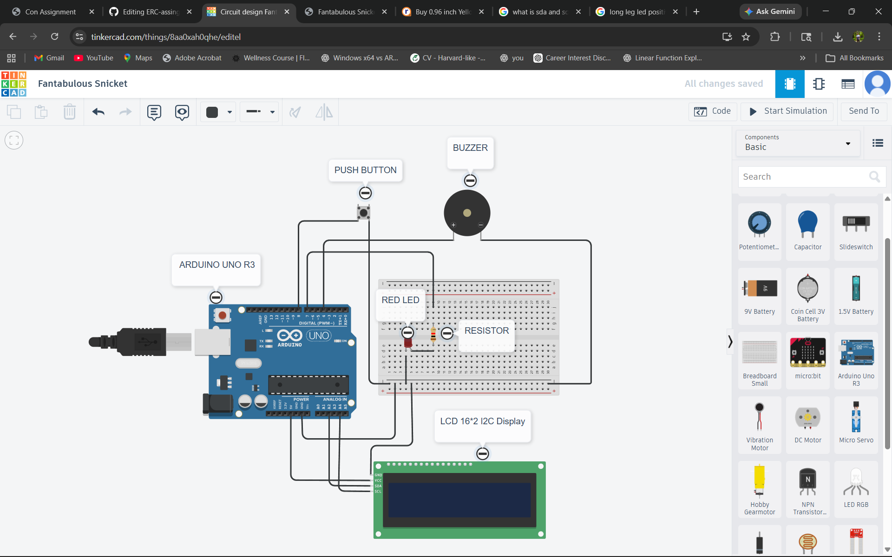
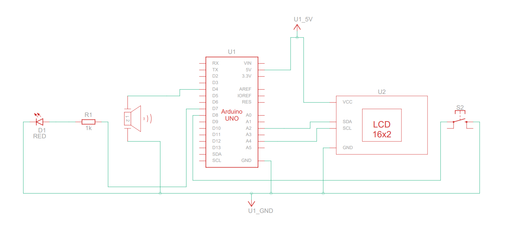

# TECH SECTION

## Question 1

1.ERC is planning to introduce a fun weekend project where participants build an
interactive microcontroller-based gadget or game on their own. Think beyond basic
circuits—this could be something like a Flappy Bird-style game, a reaction timer
challenge, a memory game, or any engaging system using a microcontroller along with
simple peripherals such as LEDs, buttons, buzzers, displays, or sensors etc. Your design
should be easy to assemble, intuitive for beginners, and exciting to use, while staying
within a budget of 1k per kit. (Don’t restrict yourself to the given example think out of
the box)

## Answer
### Bill of Materials (BOM)
| Component | Quantity | Approx Price(Rs) | source|

| Arduino UNO R3 | 1 | 500 | Robu |

| Breadboard | 1 | 40 | Robu |

| Push Button| 1 | 50 | Robu |

| Buzzer | 1 | 50 | Robu |

| Resistor | 1  | 1 | Robu |

| Red LED | 1 | 2 | Robu | 

| Jumper Wires | 10 | 15 | Robu |

| 4 Digit clock display | 1 | 50 | Robu |

Total kit price = 708 Rs

**in circuit diagram i have shown Lcd display because no oled display was available in that cad software we can instead this oled display which is convenient and budget friendly.
### Circuit Diagram

 simulation Link - https://www.tinkercad.com/things/8aa0xah0qhe-fantabulous-snicket/editel?returnTo=https%3A%2F%2Fwww.tinkercad.com%2Fdashboard
### schematic

### Arduino code
#include <Wire.h>

#include <Adafruit_GFX.h>

#include <Adafruit_LEDBackpack.h>

Adafruit_7segment display = Adafruit_7segment();

#define LED_PIN    13

#define BUZZER_PIN  8

#define BUTTON_PIN  2

void setup() {

  pinMode(LED_PIN, OUTPUT);

  pinMode(BUZZER_PIN, OUTPUT);

  pinMode(BUTTON_PIN, INPUT_PULLUP);

  randomSeed(analogRead(0));

  display.begin(0x70);

  display.setBrightness(15);

  display.writeDigitRaw(0, 0x40);

  display.writeDigitRaw(1, 0x40);

  display.writeDigitRaw(3, 0x40);

  display.writeDigitRaw(4, 0x40);

  display.writeDisplay();

  delay(2000);

}

void loop() {

  digitalWrite(LED_PIN, LOW);

  display.writeDigitRaw(0, 0x40);

  display.writeDigitRaw(1, 0x40);

  display.writeDigitRaw(3, 0x40);

  display.writeDigitRaw(4, 0x40);

  display.writeDisplay();

  delay(random(2000, 5000));

  digitalWrite(LED_PIN, HIGH);

  long startTime = millis();

  while (digitalRead(BUTTON_PIN) == HIGH) {}

  long reactionTime = millis() - startTime;

  digitalWrite(BUZZER_PIN, HIGH);

  delay(200);

  digitalWrite(BUZZER_PIN, LOW);

  digitalWrite(LED_PIN, LOW);

  display.print((int)reactionTime);

  display.writeDisplay();

  delay(3000);

}
### Explanation 

